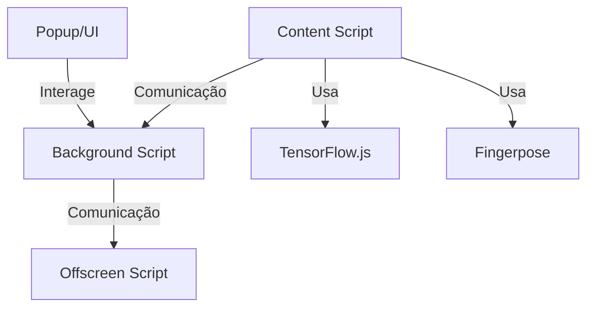

# ✋ GesturePlugin - Extensão Inteligente de Reconhecimento de Gestos

[](https://chrome.google.com/webstore/)  
[](LICENSE)
[](https://standardjs.com/)

> Uma extensão de browser que utiliza IA para reconhecer gestos com a mão em tempo real e interagir com páginas web de forma inovadora.

## 📋 Índice

- [✋ GesturePlugin - Extensão Inteligente de Reconhecimento de Gestos](#-gestureplugin---extensão-inteligente-de-reconhecimento-de-gestos)
  - [📋 Índice](#-índice)
  - [🎯 Sobre o Projeto](#-sobre-o-projeto)
    - [Características Principais](#características-principais)
  - [✨ Funcionalidades](#-funcionalidades)
  - [🏗️ Arquitetura](#️-arquitetura)
  - [🚀 Tecnologias Utilizadas](#-tecnologias-utilizadas)
  - [📦 Instalação](#-instalação)
    - [Pré-requisitos](#pré-requisitos)
    - [Passos](#passos)
  - [⚙️ Configuração](#️-configuração)
  - [🎮 Como Usar](#-como-usar)
    - [Exemplos de Gestos](#exemplos-de-gestos)
  - [📊 Estrutura do Projeto](#-estrutura-do-projeto)
  - [🤝 Contribuição](#-contribuição)
    - [Guidelines](#guidelines)
  - [📄 Licença](#-licença)

## 🎯 Sobre o Projeto

O **GesturePlugin** é uma extensão para browsers que permite controlar páginas web através de gestos com as mãos, utilizando modelos de IA para detecção e classificação de gestos em tempo real. Ideal para acessibilidade, produtividade e experiências inovadoras de navegação.

### Características Principais

- ✋ **Reconhecimento de Gestos**: Deteta gestos como "thumbs up", "thumbs down", "open hand", entre outros.
- 🤖 **IA no Browser**: Utiliza TensorFlow.js e Fingerpose para reconhecimento local, sem enviar imagens para servidores externos.
- ⚡ **Interação Rápida**: Responde instantaneamente aos gestos, permitindo ações como scroll, navegação, likes, etc.
- 🧩 **Fácil de Integrar**: Pode ser adaptado para diferentes páginas e fluxos de trabalho.

## ✨ Funcionalidades

- **Reconhecimento de múltiplos gestos** (ex: polegar para cima/baixo, mão aberta, etc.)
- **Execução de ações automáticas** (scroll, navegação, cliques, etc.)
- **Popup de configuração** para ativar/desativar gestos
- **Feedback visual** sobre o gesto detetado
- **Modo offscreen** para processamento eficiente

## 🏗️ Arquitetura



## 🚀 Tecnologias Utilizadas

- **JavaScript (ES6+)**
- **TensorFlow.js** - Detecção de mãos
- **Fingerpose** - Classificação de gestos
- **Chrome Extensions API**
- **HTML5 & CSS3**

## 📦 Instalação

### Pré-requisitos
- Google Chrome ou browser compatível

### Passos
1. **Clona o repositório**
```bash
git clone https://github.com/teu-username/GesturePlugin.git
cd GesturePlugin
```
2. **Abre o Chrome e acede a** `chrome://extensions/`
3. **Ativa o modo de programador**
4. **Clica em "Carregar sem compactação"** e seleciona a pasta do projeto

## ⚙️ Configuração

- Podes ativar/desativar gestos no popup da extensão
- Para adicionar novos gestos, edita os ficheiros em `gestures/`

## 🎮 Como Usar

1. Garante que tens webcam ligada
2. Clica no ícone da extensão para abrir o popup
3. Ativa/desativa os gestos que pretendes
4. Usa os gestos em páginas web compatíveis

### Exemplos de Gestos

| Gesto           | Ação Sugerida         |
|-----------------|----------------------|
| 👍 Thumbs Up     | Like, scroll up      |
| 👎 Thumbs Down   | Dislike, scroll down |
| 🖐️ Mão Aberta    | Parar, pausar        |

## 📊 Estrutura do Projeto

```
GesturePlugin/
├── background.js
├── content.js
├── gestures/
│   ├── openHand.js
│   └── thumbDown.js
├── libs/
│   ├── fingerpose.js
│   └── ...
├── scripts/
│   ├── detector.js
│   └── utils.js
├── popup.html
├── popup.js
├── manifest.json
├── styles/
│   └── index.css
└── ...
```

## 🤝 Contribuição

Contribuições são bem-vindas! Para contribuir:

1. Faz fork do projeto
2. Cria uma branch (`git checkout -b feature/NovaFuncionalidade`)
3. Commit das tuas alterações (`git commit -m 'Adiciona nova funcionalidade'`)
4. Push para a branch (`git push origin feature/NovaFuncionalidade`)
5. Abre um Pull Request

### Guidelines
- Mantém o código limpo e documentado
- Segue as convenções do projeto
- Testa antes de submeter

## 📄 Licença

Este projeto está licenciado sob a Licença MIT - vê o ficheiro [LICENSE](LICENSE) para detalhes.

---

**Desenvolvido com ❤️** 
