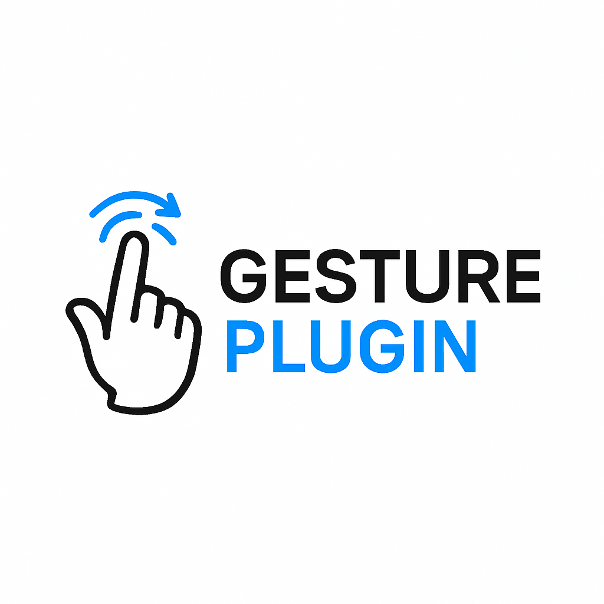

# GesturePlugin


## ✨ Descrição

O **GesturePlugin** é uma extensão para browsers baseada em reconhecimento de gestos com as mãos, utilizando inteligência artificial e visão computacional. Permite controlar funcionalidades do browser ou de páginas web através de gestos, tornando a navegação mais acessível, intuitiva e inovadora.

## 🚀 Funcionalidades

- Reconhecimento de gestos em tempo real usando webcam
- Suporte a múltiplos gestos (ex: mão aberta, outros a adicionar)
- Integração com páginas web para executar ações personalizadas
- Interface popup para ativação/desativação e configuração
- Suporte a múltiplos backends de TensorFlow.js (WebGL, WASM)
- Modularidade para adicionar novos gestos facilmente
- Design responsivo e intuitivo

## 🖼️ Demonstração



## 🛠️ Tecnologias Utilizadas

- JavaScript (ES6+)
- TensorFlow.js
- MediaPipe Hands
- Fingerpose.js
- HTML5 & CSS3
- WebExtensions API

## 📁 Estrutura de Pastas

```plaintext
GesturePlugin/
│
├── background.js           # Script de background da extensão
├── content.js              # Script injetado nas páginas
├── gestures/               # Scripts de definição de gestos
│   └── openHand.js
├── libs/                   # Bibliotecas externas (TensorFlow, MediaPipe, etc)
├── scripts/                # Scripts utilitários e de deteção
├── images/                 # Imagens e ícones
├── styles/                 # Ficheiros CSS
├── pages/                  # Páginas HTML internas
├── popup.html              # Interface popup da extensão
├── popup.js
├── manifest.json           # Manifesto da extensão
├── offscreen.html/.js      # Suporte a processamento offscreen
└── icon.png                # Ícone principal
```

## ⚙️ Instalação

1. **Clona o repositório:**
   ```bash
   git clone https://github.com/DiogoGaspar6/GesturePlugin.git
   ```
2. **Abre o Chrome/Edge/Brave e vai a `chrome://extensions/`**
3. Ativa o modo de programador (Developer mode)
4. Clica em "Carregar sem compactação" (Load unpacked)
5. Seleciona a pasta `GesturePlugin`

## 🧑‍💻 Como Usar

1. Garante que tens uma webcam ligada.
2. Clica no ícone da extensão no browser.
3. Ativa a deteção de gestos no popup.
4. Usa os gestos suportados para interagir com a página.

## ✍️ Adicionar Novos Gestos

- Cria um novo ficheiro em `gestures/` seguindo o exemplo de `openHand.js`.
- Adiciona a lógica de reconhecimento e integra no sistema principal.

## 👨‍💻 Autores

- Diogo Gaspar ([DiogoGaspar6](https://github.com/DiogoGaspar6))
- Gustavo (adicionar GitHub se aplicável)

## 📄 Licença

Este projeto está licenciado sob a licença MIT. Consulta o ficheiro LICENSE para mais detalhes. 